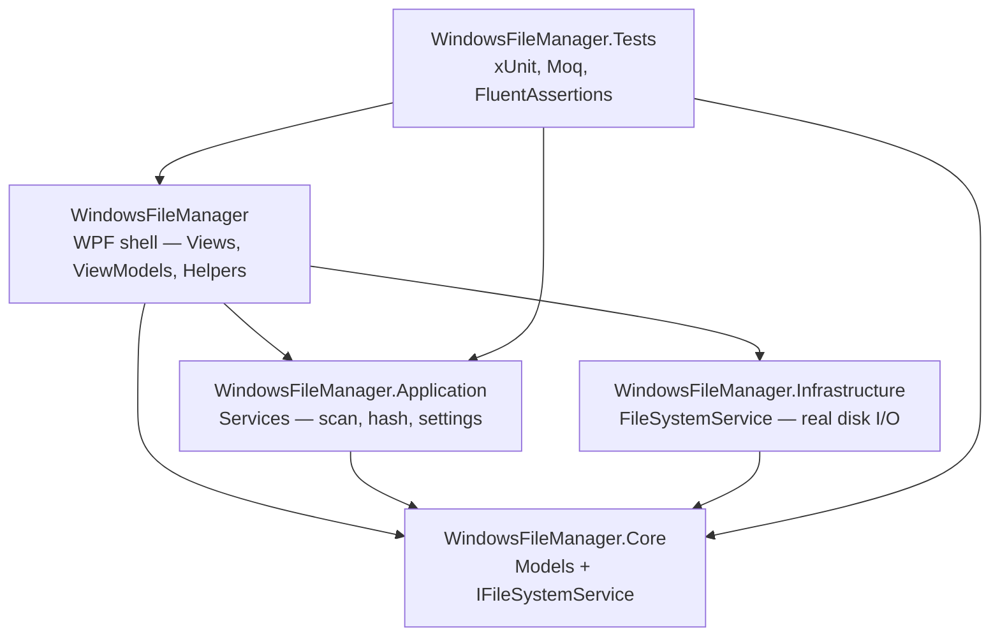
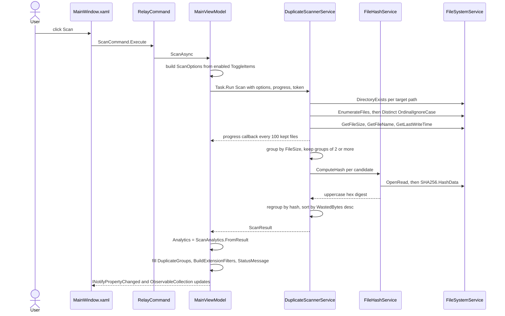

# Architecture — Folder File Control

> Structural reference for the `WindowsFileManager` solution: module map, dependency rules,
> the layered flow of the primary use case, the patterns actually in use, build outputs,
> and cross-cutting concerns. Read this before any change that crosses a project boundary.
>
> For build/test commands and conventions see [CLAUDE.md](CLAUDE.md). For per-decision
> rationale see [docs/adr/](docs/adr/). For per-feature behavior contracts see
> [docs/specs/](docs/specs/). For domain background see [docs/CONTEXT.md](docs/CONTEXT.md).

Everything below is grounded in the current source tree. Where documentation elsewhere in the
repo contradicts the code, the contradiction is called out in
[Known deviations](#9-known-deviations-and-doc-drift) rather than silently smoothed over.

---

## 1. Module map

Five projects in `WindowsFileManager.sln` — four shipped modules under `src/`, one test project
under `tests/`. The solution defines exactly two configurations, `Debug|Any CPU` and
`Release|Any CPU`; there is no x64/x86 solution platform.



The canonical one-line statement of the flow is:

```
UI -> Application -> Core <- Infrastructure
```

Core sits at the centre and depends on nothing. Application and Infrastructure both point
inward at Core. UI is the only project that references all three, because UI is also the
composition root (see [§4](#4-request-flow--a-duplicate-scan-from-click-to-result)).

### 1.1 What each module is, and what it may depend on

| Module | Path | Purpose | May depend on | Must NOT depend on |
|---|---|---|---|---|
| `WindowsFileManager.Core` | `src/WindowsFileManager.Core/` | Plain models (`ScannedFile`, `DuplicateGroup`, `ScanOptions`, `ScanResult`, `ScanAnalytics`, `FilterRule`, `FolderSearchPattern`, `FolderSearchResult`, `SubfolderItem`, `ActionHistoryEntry`, `ProfileSettings`, `AppSettings`) plus the single I/O port `IFileSystemService` | nothing — `WindowsFileManager.Core.csproj` declares zero `ProjectReference` and zero `PackageReference`, so Core takes no runtime dependency; `Directory.Build.props` still injects the build-time `StyleCop.Analyzers` analyzer into it, as into every project | every other project, and any concrete I/O type (`File`, `Directory`, `FileInfo`) |
| `WindowsFileManager.Application` | `src/WindowsFileManager.Application/` | Business services: `DuplicateScannerService`, `FileHashService`, `SettingsService` | `Core` only | `Infrastructure`, the UI project, WPF types |
| `WindowsFileManager.Infrastructure` | `src/WindowsFileManager.Infrastructure/` | The one real-disk adapter, `FileSystemService : IFileSystemService` | `Core` only | `Application`, the UI project |
| `WindowsFileManager` | `src/WindowsFileManager/` | WPF shell — `App`, `Views/`, `ViewModels/`, `Helpers/`; also the composition root | `Core`, `Application`, `Infrastructure` | nothing (it is the top of the graph) |
| `WindowsFileManager.Tests` | `tests/WindowsFileManager.Tests/` | xUnit suite — 217 tests, 0 failed, 0 skipped | `Core`, `Application`, `WindowsFileManager` | `Infrastructure` — it is deliberately not referenced, because Infrastructure is replaced by Moq doubles |

Core additionally grants `InternalsVisibleTo` to `WindowsFileManager.Application` and
`WindowsFileManager.Tests`.

### 1.2 Namespace-to-folder mapping

| Namespace | Folder |
|---|---|
| `WindowsFileManager.Core.Models` | `src/WindowsFileManager.Core/Models/` |
| `WindowsFileManager.Core.Services` | `src/WindowsFileManager.Core/Services/` |
| `WindowsFileManager.Application.Services` | `src/WindowsFileManager.Application/Services/` |
| `WindowsFileManager.Infrastructure.Services` | `src/WindowsFileManager.Infrastructure/Services/` |
| `WindowsFileManager.ViewModels` | `src/WindowsFileManager/ViewModels/` |
| `WindowsFileManager.Helpers` | `src/WindowsFileManager/Helpers/` |
| `WindowsFileManager.Views` | `src/WindowsFileManager/Views/` |

---

## 2. Why the dependency direction holds

The direction is not a convention layered on top of a flat solution — it falls out of two
concrete facts in the source tree:

1. **Core owns the interface, Infrastructure owns the implementation.**
   `IFileSystemService` is declared in `src/WindowsFileManager.Core/Services/IFileSystemService.cs`.
   The only implementation, `FileSystemService`, lives in
   `src/WindowsFileManager.Infrastructure/Services/FileSystemService.cs` and references Core to
   get the interface. So the compile-time arrow runs Infrastructure → Core, the opposite of the
   runtime call direction. That inversion is what makes Application testable without a disk.

2. **Application takes the port, never the adapter.**
   `DuplicateScannerService`, `FileHashService`, and `SettingsService` all take
   `IFileSystemService` through their constructors. None of them names `FileSystemService`,
   `File`, `Directory`, or `FileInfo`. Application's csproj references Core and nothing else, so
   an accidental use of the concrete adapter would not even compile.

### 2.1 What actually enforces it

| Mechanism | Strength | Where |
|---|---|---|
| The `ProjectReference` graph itself | Hard — a Core file that used an Application type fails to compile | the five `.csproj` files |
| Core declares no runtime `PackageReference` of its own | Hard — Core cannot pick up a transitive framework dependency without an explicit, reviewable edit. Its one package is the build-time `StyleCop.Analyzers` analyzer that `Directory.Build.props` injects into every project | `src/WindowsFileManager.Core/WindowsFileManager.Core.csproj` (analyzer from `Directory.Build.props:10-13`) |
| `TreatWarningsAsErrors` + `CodeAnalysisTreatWarningsAsErrors` + StyleCop, applied to every project | Hard for style/analyzer violations; says nothing about layering | `Directory.Build.props` |
| Coverage `Include` list naming only Core, Application, and the UI's `Helpers`/`ViewModels` | Soft — pressures logic toward the covered modules, since anything landing there must be fully tested | `tests/WindowsFileManager.Tests/coverlet.runsettings` |

**Honest gap:** there is no architecture-fitness test, no `NetArchTest`/`ArchUnitNET` suite, and no
dependency-direction lint. Nothing would stop a contributor from adding
`<ProjectReference Include="..\WindowsFileManager.Infrastructure\..." />` to Application; the
build would succeed. The direction is preserved by review and by the fact that the alternative is
never convenient, not by an automated gate.

**Honest defect:** `src/WindowsFileManager.Application/WindowsFileManager.Application.csproj`
declares `InternalsVisibleTo` for `WindowsFileManager.Application.Tests` — an assembly that does
not exist. The real test assembly is `WindowsFileManager.Tests`, so **Application internals are not
visible to the test project**. Every Application type currently under test is public, so nothing is
broken today, but the grant is inert.

---

## 3. Composition root

There is **no DI container and no service locator**. Wiring is manual, in one place.

`src/WindowsFileManager/App.xaml` sets `StartupUri="Views/MainWindow.xaml"`, and
`src/WindowsFileManager/App.xaml.cs` is an empty partial class. `Views/MainWindow.xaml` declares
its own view model:

```xml
<Window.DataContext>
    <vm:MainViewModel />
</Window.DataContext>
```

so WPF constructs `MainViewModel` through its parameterless constructor, which chains to the real
one (`src/WindowsFileManager/ViewModels/MainViewModel.cs:606-615`):

```csharp
public MainViewModel()
    : this(CreateDefaultScanner(), CreateDefaultSettings(), new FileSystemService())

internal MainViewModel(DuplicateScannerService scannerService, SettingsService settingsService, IFileSystemService fileSystem)
```

`CreateDefaultScanner()` builds `new DuplicateScannerService(fs, new FileHashService(fs))` over a
fresh `FileSystemService`; `CreateDefaultSettings()` builds
`new SettingsService(new FileSystemService(), %APPDATA%\WindowsFileManager\settings.json)`
(`MainViewModel.cs:4943-4956`). The `internal` overload takes the three collaborators directly, but it
is **not currently a test seam**: `src/WindowsFileManager/WindowsFileManager.csproj` declares no
`InternalsVisibleTo`, so the test assembly cannot reach it, and no test constructs `MainViewModel`
(the class is also `[ExcludeFromCodeCoverage]`, `MainViewModel.cs:25`). `MainViewModel` is therefore
not directly unit-tested. Making the overload a real seam would mean adding
`<InternalsVisibleTo Include="WindowsFileManager.Tests" />` to the UI csproj, the way Core already
does (`WindowsFileManager.Core.csproj:10-11`). [ADR-002](docs/adr/ADR-002-hand-rolled-mvvm.md) reads
it the same way.

Consequence to know: because the object graph is built inside `MainViewModel`, adding a new service
means editing those two static factory methods — there is no registration list to append to.

---

## 4. Request flow — a duplicate scan, from click to result

This is the primary use case. Behavior contract:
[docs/specs/SPEC-001-duplicate-detection.md](docs/specs/SPEC-001-duplicate-detection.md).



Step by step, with the real types:

1. **View → command.** The Scan button binds to `MainViewModel.ScanCommand`, a
   `WindowsFileManager.Helpers.RelayCommand` whose `canExecute` is `CanScan()` —
   `!IsScanning && TargetPaths.Any(t => t.IsEnabled)` (`MainViewModel.cs:2258`).
2. **View model builds the request.** `ScanAsync()` (`MainViewModel.cs:2260`) clears
   `DuplicateGroups`, calls `MiniPreviewConverter.ClearCache()`, calls `SaveSettings()`, creates a
   fresh `CancellationTokenSource`, then constructs a
   `WindowsFileManager.Core.Models.ScanOptions` from the enabled `ToggleItem` rows —
   `TargetPaths`, `IncludeSubdirectories`, `ExcludeFolderNames`, and `MatchRegex` (the last only
   when the regex toggle is on *and* the pattern is non-blank).
3. **Off the UI thread.** `await Task.Run(() => _scannerService.Scan(options, count => FilesScanned = count, token), token)`.
4. **Guards, inside the service.** `DuplicateScannerService.Scan` throws
   `ArgumentException("At least one target path is required.")` on an empty path list, and
   `DirectoryNotFoundException($"Directory not found: {path}")` for the first path that fails
   `IFileSystemService.DirectoryExists` — both *before* any enumeration begins and before the
   stopwatch starts.
5. **Enumerate and de-duplicate paths.** Either the private `EnumerateFilesExcluding` walker (when
   exclusions exist *and* `IncludeSubdirectories` is true) or a plain
   `EnumerateFiles(path, "*.*", AllDirectories|TopDirectoryOnly)` per target. Both are wrapped in
   `.SelectMany(...).Distinct(StringComparer.OrdinalIgnoreCase)`, which is exactly where
   overlapping target folders collapse to one entry per file.
6. **Filter and materialise.** Per file: `ThrowIfCancellationRequested()`, drop below
   `MinimumFileSize`, drop when `FileExtensions` is non-empty and the extension is not listed, then
   build a `ScannedFile`. Only kept files increment `filesScanned`, and that counter is what
   `ScanResult.TotalFilesScanned` reports.
7. **Group.** `MatchRegex` non-blank routes to `GroupByNameRegex` (name-pattern grouping, size and
   content never consulted); otherwise `GroupBySizeAndHash` — group by size, keep groups of two or
   more, then hash each member through `FileHashService.ComputeHash` and regroup by digest.
8. **Finalise.** Stopwatch stops, groups sort by `WastedBytes` descending, `TotalDuplicates` and
   `TotalWastedBytes` are summed, and a `ScanResult` returns.
9. **Back on the UI thread.** `ScanAsync` assigns `LastResult`, sets
   `Analytics = ScanAnalytics.FromResult(result)`, appends each `DuplicateGroup` to the
   `ObservableCollection`, calls `BuildExtensionFilters(...)`, and writes `StatusMessage`. Bindings
   and `CollectionViewSource` do the rest.

The only type in that chain that touches the disk is `FileSystemService`, and the only reason the
service layer can reach it is the `IFileSystemService` reference it was handed at construction.

---

## 5. Design patterns in use

Each row names a pattern that is genuinely present, with the file that demonstrates it.

| Pattern | Where it lives | How it shows up |
|---|---|---|
| **Clean Architecture / dependency inversion** | `src/WindowsFileManager.Core/Services/IFileSystemService.cs` + `src/WindowsFileManager.Infrastructure/Services/FileSystemService.cs` | The port is declared in the innermost module; the adapter in the outermost one implements it. See [ADR-001](docs/adr/ADR-001-clean-architecture-four-modules.md), [ADR-004](docs/adr/ADR-004-ifilesystemservice-io-abstraction.md). |
| **Interface-segregated I/O (single port)** | `IFileSystemService` — 11 members: `EnumerateFiles`, `GetFileSize`, `GetLastWriteTime`, `OpenRead`, `DirectoryExists`, `GetFileName`, `FileExists`, `ReadAllText`, `WriteAllText`, `CreateDirectory`, `EnumerateDirectories` | Every Application service takes it by constructor; every unit test hands it a `Mock<IFileSystemService>`. |
| **Hand-rolled MVVM** | `src/WindowsFileManager/ViewModels/ViewModelBase.cs`, `ViewModels/MainViewModel.cs`, `Views/MainWindow.xaml` | `ViewModelBase` supplies `INotifyPropertyChanged` and `SetProperty<T>(ref field, value, [CallerMemberName])`, which no-ops when `EqualityComparer<T>.Default` reports no change. No MVVM framework is referenced. See [ADR-002](docs/adr/ADR-002-hand-rolled-mvvm.md). |
| **Command pattern** | `src/WindowsFileManager/Helpers/RelayCommand.cs` | `ICommand` over `Action<object?>` plus an optional `Predicate<object?>`; `CanExecuteChanged` forwards to `CommandManager.RequerySuggested`, so re-query is driven by WPF rather than by the view model. |
| **Value converters** | `src/WindowsFileManager/Helpers/Converters.cs` (`BoolToVisibilityConverter`, `InverseBoolToVisibilityConverter`, `InverseBoolConverter`, `SubtractConverter`, `PercentToWidthConverter`), `Helpers/FileTypeIconConverter.cs`, `Helpers/MiniPreviewConverter.cs` | Presentation-only transforms kept out of the view model. `PercentToWidthConverter` is both a `MarkupExtension` and an `IMultiValueConverter`, so a bar width is computed from container width and percent together. |
| **Attached behaviors** | `src/WindowsFileManager/Helpers/FormattedTextBehavior.cs`, `Helpers/TextBoxEnterKeyBehavior.cs` | `DependencyProperty.RegisterAttached` adds behavior to stock controls without subclassing — rich-text help markup on a `TextBlock`, Enter-key-to-command on a `TextBox`. |
| **Observer via `INotifyPropertyChanged` on models** | `Core/Models/ScannedFile.cs`, `FilterRule.cs`, `FolderSearchPattern.cs`, `FolderSearchResult.cs`, `SubfolderItem.cs` | Selection and enable/disable flags raise change notifications so list rows update without rebuilding the collection. |
| **Static factory / projection** | `Core/Models/ScanAnalytics.cs` — `ScanAnalytics.FromResult(ScanResult)` | The dashboard model is derived from a scan result in one place instead of being assembled in the view model. |
| **Undo stack (command history)** | `Core/Models/ActionHistoryEntry.cs` + `MainViewModel.PushHistory` (`:4106`) / `UndoEntry` (`:4138`) | Each destructive action records what it did (`Moves`, `RecycledPaths`, `CreatedShortcuts`) so it can be reversed; the stack is capped at `MaxHistoryEntries = 30` and persisted with settings. |
| **Manual composition root** | `MainViewModel.cs:606-615`, `:4943-4956` | Poor-man's DI: the object graph is built by two private static factories. No container. |

Deliberately **not** present, so nobody goes looking: no DI container, no repository/unit-of-work
layer, no mediator/message bus, no plugin or extension model, no navigation service — the shell is a
single window with a `TabControl`.

---

## 6. Build outputs

### 6.1 Per project

| Project | TFM | Output type | Artifact | Notes |
|---|---|---|---|---|
| `WindowsFileManager.Core` | `net8.0-windows` | Library | `WindowsFileManager.Core.dll` | no project refs, and no package in its own csproj — `Directory.Build.props` still injects the build-time `StyleCop.Analyzers` analyzer |
| `WindowsFileManager.Application` | `net8.0-windows10.0.22621.0` | Library | `WindowsFileManager.Application.dll` | refs Core |
| `WindowsFileManager.Infrastructure` | `net8.0-windows` | Library | `WindowsFileManager.Infrastructure.dll` | refs Core; `FileSystemService` is `[ExcludeFromCodeCoverage]` |
| `WindowsFileManager` | `net8.0-windows10.0.22621.0` | `WinExe` | `WindowsFileManager.exe` + the three libraries | `UseWPF=true`, `TargetPlatformMinVersion=10.0.17763.0`, `RuntimeIdentifiers=win-x64`, `ApplicationIcon=Assets\app-icon.ico`; `Assets\*.png` copied to output |
| `WindowsFileManager.Tests` | `net8.0-windows10.0.22621.0` | Test library | `WindowsFileManager.Tests.dll` | `IsTestProject=true`, `IsPackable=false`, `UseWPF=true` |

All five set `<Nullable>enable</Nullable>` and `<ImplicitUsings>enable</ImplicitUsings>`. Binaries
land under `<project>/bin/<Debug|Release>/<TFM>/`.

Platform story: **AnyCPU at the solution level**; `win-x64` appears only as the publish/packaging
RID (`RuntimeIdentifiers` in the UI csproj, `RUNTIME_ID: win-x64` in the MSIX workflow,
`ProcessorArchitecture="x64"` in the manifest). No `PlatformTarget`, no `app.manifest`, and no
`requestedExecutionLevel` — the app runs non-elevated. See
[ADR-008](docs/adr/ADR-008-msix-packaging-anycpu-store.md).

### 6.2 Publish and MSIX

```
dotnet publish src/WindowsFileManager -c Release -r win-x64 --self-contained true -o publish-output
```

`.github/workflows/msix-pipeline.yml` then assembles the package by hand — there is **no Windows
Application Packaging Project and no `WindowsPackageType=MSIX` build**:

1. `publish-output/*` is copied into `msix-layout/`.
2. `src/WindowsFileManager/Package.appxmanifest` is copied to `msix-layout/AppxManifest.xml`.
3. `src/WindowsFileManager/Assets/*.png` is copied to `msix-layout/Assets/`.
4. The newest x64 `makeappx.exe` under `C:\Program Files (x86)\Windows Kits\10\bin` runs
   `pack /d msix-layout /p output/WindowsFileManager.msix /o`.
5. If the `CERTIFICATE_PFX` secret is present **and** the event is a push to `main`, `signtool`
   signs with `/fd SHA256 /tr http://timestamp.digicert.com /td SHA256`.
6. The `.msix` is uploaded as the `msix-package` artifact; a downstream job runs the Windows App
   Certification Kit (`appcert.exe`) and uploads `wack-report`.

Manifest facts that constrain packaging: `Identity Name="WindowsFileManager"`,
`Version="1.0.0.0"`, `Publisher="CN=WindowsFileManager"`, `DisplayName` "Folder File Control",
`TargetDeviceFamily Windows.Desktop` min `10.0.17763.0` / max-tested `10.0.22621.0`,
`EntryPoint="Windows.FullTrustApplication"`, and the single restricted capability
`rescap:Capability Name="runFullTrust"`. The signing subject must equal the manifest `Publisher`
or install fails — see [docs/SECURITY.md](docs/SECURITY.md).

### 6.3 CI artifacts

| Workflow | Job | Artifact |
|---|---|---|
| `.github/workflows/ci.yml` — Quality Gate | `quality-gate` | `coverage-report` from `tests/**/TestResults/**/coverage.cobertura.xml` |
| `.github/workflows/msix-pipeline.yml` — MSIX Store Pipeline | `security-scan` | Semgrep SARIF uploaded to GitHub code scanning |
| same | `build-and-package` | `msix-package` |
| same | `wack-validation` | `wack-report` |

---

## 7. Cross-cutting concerns

### 7.1 Cancellation

- **Scan.** `MainViewModel` owns `_cancellationTokenSource`; `CancelCommand` calls `Cancel()` on it.
  The token reaches `DuplicateScannerService.Scan` and is checked at three points: once per file
  during metadata collection, once per size-group before hashing that group, and once per file
  during regex matching. It is **not** checked inside the hashing of a single file, and **not**
  inside a single `Regex.Match`.
- **Regex timeout as the substitute.** Because the token cannot interrupt a match,
  `GroupByNameRegex` compiles with `TimeSpan.FromSeconds(1)` and converts a
  `RegexMatchTimeoutException` into an `ArgumentException` naming the offending file. That is the
  ReDoS backstop for user-authored patterns.
- **Folder search** uses its own `_folderSearchCts`; cancelling reports
  `"Search stopped. N folders found so far."` and `SaveSettings()` still runs in the `finally`.
- **Surfacing.** `ScanAsync` catches `OperationCanceledException` and writes
  `"Scan cancelled."` to `StatusMessage`; cancellation is never an error dialog.

### 7.2 Progress reporting

Two independent mechanisms:

| Mechanism | Used by | Behavior |
|---|---|---|
| `Action<int>? progress` on `Scan` | duplicate scan | Invoked every 100 *kept* files, plus one unconditional final invoke after the loop. 250 files therefore report 100, 200, 250; 2 files report only 2. The view model's lambda assigns `FilesScanned`. |
| `IProgress<int>` from `MainViewModel.CreateBusyProgress()` (`:1836`) | every long file operation — delete, move, flatten, clear-subfolders, folder search | `new Progress<int>(n => BusyCurrent = n)` captures the UI `SynchronizationContext` at construction, so callbacks marshal back automatically. |

The busy bar itself is driven by `BeginBusy(status, total, unit)` (`:1795`) and `EndBusy()`
(`:1816`), which are **re-entrant via a `_busyDepth` counter** — nested operations do not clear the
bar early. `BusyIsIndeterminate` is true while busy with no known total; `BusyEta` extrapolates from
the observed rate and is suppressed below 500 ms elapsed.

### 7.3 Threading and the dispatcher

- WPF's single UI thread owns every `ObservableCollection` and every bound property.
- The scan runs under `Task.Run`; several long operations use `.ConfigureAwait(true)` deliberately
  (`MainViewModel.cs:3797`, `:4022`, `:4067`) because the continuation touches observable
  collections.
- Long-running handlers are `async void` (`ScanAsync`, `SearchFoldersAsync`, `FlattenSelectedFolders`,
  `LinkSiblingFolders`, the `ClearSelected*` pair, `DeleteSelectedFiles`, `MoveSelectedFiles`). Only
  `ScanAsync` and `SearchFoldersAsync` have broad catch blocks — an unobserved exception in the
  others crashes the process. Treat that as a known hazard when adding a new bulk operation.
- `_resourceTimer` is a 2-second `DispatcherTimer` feeding the CPU/RAM/thread readout.
- `Views/MainWindow.xaml.cs` defers the media first-frame pause to
  `Dispatcher.BeginInvoke(DispatcherPriority.Loaded, …)` so a thumbnail renders before pausing.

### 7.4 Settings persistence

- **Location.** `%APPDATA%\WindowsFileManager\settings.json`, composed in
  `MainViewModel.CreateDefaultSettings()` (`:4949`). `SettingsService` itself takes the path as a
  constructor argument, so tests point it at a fake.
- **Cadence.** `SaveSettings()` (`:1878`) is called on *every* mutation — toggling a path, adding or
  reordering a rule, changing a sort option — not on window close. Two guards suppress the storm:
  `_isSwitchingProfile` during a profile swap, and `_isBulkFolderSelectionUpdate` during bulk
  folder selection. See [ADR-006](docs/adr/ADR-006-persist-settings-on-every-mutation.md) and
  [docs/specs/SPEC-009-settings-and-window-state-persistence.md](docs/specs/SPEC-009-settings-and-window-state-persistence.md).
- **Window geometry** is the exception: it is written on `Closing` via `SaveWindowState(...)`
  (`:1783`), using `RestoreBounds` when maximized so the saved size is the normal size. Geometry and
  action history are global, not per profile.
- **Back-compat, five layers.** Enum ordinals are pinned by tests and never renumbered;
  `System.Text.Json` ignores unknown properties; absent properties fall back to C# initializers;
  computed members carry `[JsonIgnore]`; and `SettingsService.Load()` migrates the legacy flat
  schema into a single `"Default"` profile when `Profiles.Count == 0`. See
  [ADR-007](docs/adr/ADR-007-system-text-json-settings-compatibility.md).

### 7.5 Error handling

| Layer | Style |
|---|---|
| Application services | Throw typed exceptions with context — `ArgumentException` for an empty path list or an invalid/timed-out regex, `DirectoryNotFoundException` naming the missing path. `SettingsService.Load()` is the opposite: **two** levels of `JsonException` tolerance, degrading to defaults rather than throwing — whole-file parse (`SettingsService.cs:45`, returns `CreateDefault()`) and legacy migration (`:125`, keeps whatever the profile already holds). There is **no per-element tolerance**: `ReadObjectList` (`:153`) calls `JsonSerializer.Deserialize<T>` (`:162`) unguarded, so one malformed `FilterRules`/`FolderSearchPatterns` element throws out of the whole `MigrateLegacyProfile` body into the `:125` handler and every field not yet read is abandoned at its default. |
| View model, scan path | `ScanAsync` catches exactly `OperationCanceledException`, `DirectoryNotFoundException`, and `ArgumentException`, each rendered into `StatusMessage`. Anything else propagates. |
| View model, destructive loops | `try { … } catch { failed++; }` per item — errors are **counted, not logged and not attributed**. The user sees "N failed" with no cause. |
| Interop helpers | `MiniPreviewConverter`, `ShortcutHelper`, and the Recycle-Bin restore path swallow failures and return a null/false/zero result. |
| UI feedback | `StatusMessage` for outcomes, `MessageBox` for confirmations before destructive actions. There is no log file and no telemetry. |

---

## 8. ADR summary

Index: [docs/adr/](docs/adr/).

| ADR | Title | What it settles |
|---|---|---|
| [ADR-001](docs/adr/ADR-001-clean-architecture-four-modules.md) | Clean Architecture with four modules (Core / Application / Infrastructure / UI) | The module split and the inward dependency rule of [§1](#1-module-map) |
| [ADR-002](docs/adr/ADR-002-hand-rolled-mvvm.md) | Hand-rolled MVVM (`ViewModelBase` + `RelayCommand`) instead of an MVVM framework | Why there is no CommunityToolkit.Mvvm / Prism / Caliburn dependency |
| [ADR-003](docs/adr/ADR-003-three-stage-duplicate-detection.md) | Three-stage duplicate detection (size grouping, then SHA256, then confirmation) | The scan algorithm in [§4](#4-request-flow--a-duplicate-scan-from-click-to-result) |
| [ADR-004](docs/adr/ADR-004-ifilesystemservice-io-abstraction.md) | All I/O behind `IFileSystemService`, with Infrastructure excluded from coverage | Why one port carries every disk call and why the adapter is untested |
| [ADR-005](docs/adr/ADR-005-coverage-enforcement-coverlet-msbuild.md) | 100% coverage enforced by `coverlet.msbuild` in the test csproj (moved off `coverlet.runsettings`) | **Superseded by ADR-011** — kept for the history of how the 100% bar was established |
| [ADR-006](docs/adr/ADR-006-persist-settings-on-every-mutation.md) | Persist settings on every mutation rather than on window close | The save cadence of [§7.4](#74-settings-persistence) |
| [ADR-007](docs/adr/ADR-007-system-text-json-settings-compatibility.md) | `System.Text.Json` settings with enum-ordinal stability and `[JsonIgnore]` on computed properties | The back-compat contract for `settings.json` |
| [ADR-008](docs/adr/ADR-008-msix-packaging-anycpu-store.md) | MSIX packaging on AnyCPU targeting the Microsoft Store | The packaging pipeline of [§6.2](#62-publish-and-msix) |
| [ADR-009](docs/adr/ADR-009-treat-warnings-as-errors.md) | `TreatWarningsAsErrors` with StyleCop and .NET analyzers as build gates | Why a warning breaks the build — see `Directory.Build.props` |
| [ADR-010](docs/adr/ADR-010-wpf-net8-desktop-shell.md) | WPF on .NET 8 for the desktop shell (and why `dotnet watch` is not usable) | The UI framework choice and its dev-loop consequence |
| [ADR-011](docs/adr/ADR-011-coverage-via-collector-and-script.md) | Measure coverage with `coverlet.collector`, enforce the 100% threshold with `scripts/Check-Coverage.ps1` (supersedes ADR-005) | Where the threshold actually lives, and why `dotnet test` alone no longer enforces it |

---

## 9. Known deviations and doc drift

Recorded so a future reader does not have to rediscover them.

| Item | Reality |
|---|---|
| Coverage `Exclude` entry `[WindowsFileManager]*Helpers.Win32Api*` | No `Win32Api` type exists in the tree. Dead exclusion, in `tests/WindowsFileManager.Tests/coverlet.runsettings`. |
| `ScanOptions.MinimumFileSize` and `ScanOptions.FileExtensions` | Fully implemented and fully tested in `DuplicateScannerService`, but `MainViewModel.ScanAsync` never sets either. `MinimumFileSize` is persisted per profile yet never fed into a scan; `FileExtensions` is never set from the UI at all. Both filters are unreachable from the running app. Post-scan filtering by size and extension does exist, in `MainViewModel.ApplyFilters`/`FilterDuplicateGroup` — a different mechanism. |
| `BuildRegexKey` comment in `DuplicateScannerService` | The comment says capture groups are joined with SOH (0x01) so `("ab","c")` and `("a","bc")` stay distinct; the code is `string.Join("", parts)`, an empty separator, so those tuples collide. No test covers it. |
| Delete help popup in `Views/MainWindow.xaml` | Says Delete is permanent with "No Recycle Bin — cannot be undone." The code recycles via `Microsoft.VisualBasic.FileIO.FileSystem.DeleteFile(..., SendToRecycleBin)` and pushes an undo entry. |
| `RemoveEmptyDirectoriesRecursive` | The one destructive path that is **not** recycled and **not** recorded in `ActionHistory` — `Directory.Delete` is permanent and unundoable. |
| History tab activation | `TabControl_SelectionChanged` matches on a string tab header, but the History tab's header is a `TextBlock`, so `IsHistoryActive` is effectively never true. |
| Folder search location | Implemented in the UI layer (`MainViewModel.SearchFoldersAsync` `:3213`, `SearchFoldersRecursive` `:3299`), **not** in Core or Application, and `FolderContainsItem` calls `System.IO.Directory`/`File` directly rather than going through `IFileSystemService`. It is the one place the port is bypassed. |
| Solution platforms | Only `Any CPU`. `win-x64` exists solely as a publish/packaging RID. |

---

## 10. Where to look

| Task | Open |
|---|---|
| Change how duplicates are detected or grouped | `src/WindowsFileManager.Application/Services/DuplicateScannerService.cs`; spec [SPEC-001](docs/specs/SPEC-001-duplicate-detection.md); tests `tests/WindowsFileManager.Tests/Services/DuplicateScannerServiceTests.cs` |
| Change hashing (algorithm, chunking, size cap) | `src/WindowsFileManager.Application/Services/FileHashService.cs`; tests `tests/.../Services/FileHashServiceTests.cs`; decision [ADR-003](docs/adr/ADR-003-three-stage-duplicate-detection.md) |
| Add a scan-time filter (size, extension, path shape) | `src/WindowsFileManager.Core/Models/ScanOptions.cs` + `DuplicateScannerService.Scan` step 1, **and** `MainViewModel.ScanAsync` (`:2260`) — the view model is where the existing filters are currently not wired |
| Add a post-scan display filter | `src/WindowsFileManager/ViewModels/MainViewModel.cs` — `ApplyFilters` (`:2519`) and `FilterDuplicateGroup` (`:2598`); spec [SPEC-002](docs/specs/SPEC-002-filtering-and-sorting.md) |
| Add or change a sort option | `MainViewModel.ApplySorting` (`:2547`) plus the `SortOptions` list; spec [SPEC-002](docs/specs/SPEC-002-filtering-and-sorting.md) |
| Change custom filter-rule matching | `src/WindowsFileManager.Core/Models/FilterRule.cs` + `MainViewModel.ApplyFilterRules` (`:2999`) / `MatchesFilter` (`:3041`); spec [SPEC-003](docs/specs/SPEC-003-custom-filter-rules.md) |
| Add a selection or file action (move, delete, open) | `MainViewModel` command block in the constructor (`:617` onward) + the matching private method; spec [SPEC-004](docs/specs/SPEC-004-selection-and-file-actions.md) |
| Add a preview type | `MainViewModel.PreviewFile` (`:2636`) and the extension `HashSet`s at the top of `MainViewModel.cs`, then the `PreviewType` `DataTrigger`s in `src/WindowsFileManager/Views/MainWindow.xaml`; thumbnails in `Helpers/MiniPreviewConverter.cs`; spec [SPEC-005](docs/specs/SPEC-005-file-preview.md) |
| Change the analytics dashboard or resource monitor | `src/WindowsFileManager.Core/Models/ScanAnalytics.cs` (`FromResult`) and `Helpers/Converters.cs` (`PercentToWidthConverter`); monitor in `MainViewModel.UpdateResourceInfo`; spec [SPEC-006](docs/specs/SPEC-006-analytics-and-resource-monitor.md) |
| Change folder-search match semantics | `MainViewModel.SearchFoldersRecursive` (`:3299`) + `src/WindowsFileManager.Core/Models/FolderSearchPattern.cs`; spec [SPEC-007](docs/specs/SPEC-007-folder-search.md) |
| Change the clear-subfolders flow | `src/WindowsFileManager.Core/Models/SubfolderItem.cs` + `MainViewModel.ScanSubfolders` / `ClearSelectedSubfolders`; spec [SPEC-008](docs/specs/SPEC-008-clear-subfolders.md) |
| Add a persisted setting | `src/WindowsFileManager.Core/Models/ProfileSettings.cs` (per profile) or `AppSettings.cs` (global), then `SnapshotLiveStateInto` / `ApplyProfileToLiveState` in `MainViewModel`; migration in `src/WindowsFileManager.Application/Services/SettingsService.cs`; spec [SPEC-009](docs/specs/SPEC-009-settings-and-window-state-persistence.md) |
| Add a help popup or change its markup | `src/WindowsFileManager/Views/MainWindow.xaml` (`HelpButtonStyle`, the control's `Tag`) + `src/WindowsFileManager/Helpers/FormattedTextBehavior.cs`; spec [SPEC-010](docs/specs/SPEC-010-contextual-help.md) |
| Add a new file-system operation | Add the member to `src/WindowsFileManager.Core/Services/IFileSystemService.cs`, implement it in `src/WindowsFileManager.Infrastructure/Services/FileSystemService.cs`, then mock it in the affected tests |
| Add a value converter or attached behavior | `src/WindowsFileManager/Helpers/` — and remember `Helpers` is inside the coverage `Include` list, so it needs full test coverage |
| Change build gates, analyzers, or style rules | `Directory.Build.props`, `.editorconfig`, `stylecop.json`; decision [ADR-009](docs/adr/ADR-009-treat-warnings-as-errors.md) |
| Change the coverage scope | `tests/WindowsFileManager.Tests/coverlet.runsettings` — the single source of `Include`/`Exclude`, read by the `XPlat Code Coverage` collector; decision [ADR-011](docs/adr/ADR-011-coverage-via-collector-and-script.md) |
| Change the coverage threshold | `scripts/Check-Coverage.ps1` — it reads the Cobertura report and fails below 100% line/branch/method (`-Threshold` overrides, `-ReportPath` picks a specific report); decision [ADR-011](docs/adr/ADR-011-coverage-via-collector-and-script.md) |
| Change CI or the MSIX pipeline | `.github/workflows/ci.yml`, `.github/workflows/msix-pipeline.yml`, `src/WindowsFileManager/Package.appxmanifest`, `scripts/New-DevCertificate.ps1`; decision [ADR-008](docs/adr/ADR-008-msix-packaging-anycpu-store.md); guardrails [docs/SECURITY.md](docs/SECURITY.md) |
| Set up, build, or run locally | [docs/DEV.md](docs/DEV.md) — the SDK is .NET 8.0.422 at `D:\_env_storeage\dotnet` on this machine and is **not** on `PATH` |
| Look up a term used above | [docs/GLOSSARY.md](docs/GLOSSARY.md) |
